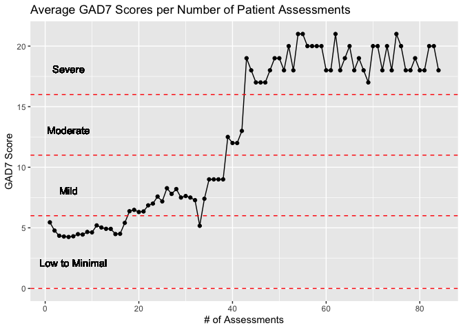
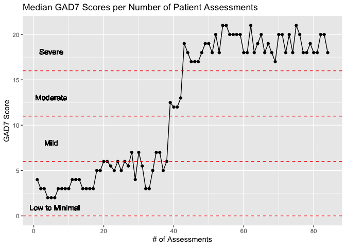

NeuroFlow Data Challenge
================
Ty Painter
Fri May 21 10:01:59 2021

``` r
# load packages
library(tidyverse)
```

    ## ── Attaching packages ─────────────────────────────────────── tidyverse 1.3.0 ──

    ## ✓ ggplot2 3.3.3     ✓ purrr   0.3.4
    ## ✓ tibble  3.1.1     ✓ dplyr   1.0.3
    ## ✓ tidyr   1.1.2     ✓ stringr 1.4.0
    ## ✓ readr   1.4.0     ✓ forcats 0.5.0

    ## ── Conflicts ────────────────────────────────────────── tidyverse_conflicts() ──
    ## x dplyr::filter() masks stats::filter()
    ## x dplyr::lag()    masks stats::lag()

``` r
library(ggplot2)
library(dplyr)
```

# Load Data

``` r
library(readr)
phq_all_final <- read_csv("/Users/TyPainter1/Downloads/neuroflow_data_challenge/phq_all_final.csv") # update file path to run on local machine
```

    ## 
    ## ── Column specification ────────────────────────────────────────────────────────
    ## cols(
    ##   date = col_datetime(format = ""),
    ##   patient_id = col_double(),
    ##   type = col_character(),
    ##   patient_date_created = col_datetime(format = ""),
    ##   score = col_double()
    ## )

``` r
head(phq_all_final)
```

    ## # A tibble: 6 x 5
    ##   date                patient_id type  patient_date_created score
    ##   <dttm>                   <dbl> <chr> <dttm>               <dbl>
    ## 1 2019-08-26 13:32:43       8430 gad7  2019-06-03 13:23:02      6
    ## 2 2019-11-15 17:55:11       8430 gad7  2019-06-03 13:23:02      1
    ## 3 2019-10-07 18:23:29      14338 gad7  2019-06-03 13:32:30     10
    ## 4 2019-11-04 20:16:28      14338 gad7  2019-06-03 13:32:30      7
    ## 5 2019-12-02 20:56:55      14338 gad7  2019-06-03 13:32:30      9
    ## 6 2019-09-17 14:08:49      17028 gad7  2019-06-03 14:24:06      6

``` r
summary(phq_all_final) # check variable values
```

    ##       date                       patient_id        type          
    ##  Min.   :2019-06-06 16:31:34   Min.   :    0   Length:53698      
    ##  1st Qu.:2019-12-31 18:41:08   1st Qu.: 4697   Class :character  
    ##  Median :2020-03-18 15:25:11   Median : 9228   Mode  :character  
    ##  Mean   :2020-03-05 10:04:55   Mean   : 9223                     
    ##  3rd Qu.:2020-05-19 03:05:57   3rd Qu.:13809                     
    ##  Max.   :2020-07-31 20:11:33   Max.   :18400                     
    ##  patient_date_created              score       
    ##  Min.   :2019-06-03 13:23:02   Min.   : 0.000  
    ##  1st Qu.:2019-10-09 17:43:49   1st Qu.: 1.000  
    ##  Median :2020-01-02 15:31:03   Median : 3.000  
    ##  Mean   :2019-12-23 06:11:49   Mean   : 4.785  
    ##  3rd Qu.:2020-03-02 14:23:21   3rd Qu.: 7.000  
    ##  Max.   :2020-07-31 17:58:21   Max.   :21.000

# Exploratory Data Analysis

## Categorize Scores into Severity Label

``` r
phq_all_final$severity <- cut(phq_all_final$score,c(-1,5,10,15,21)) # set ranges for severity labels
levels(phq_all_final$severity) = c("Low to Minimal", "Mild", "Moderate", "Severe")
head(phq_all_final)
```

    ## # A tibble: 6 x 6
    ##   date                patient_id type  patient_date_created score severity      
    ##   <dttm>                   <dbl> <chr> <dttm>               <dbl> <fct>         
    ## 1 2019-08-26 13:32:43       8430 gad7  2019-06-03 13:23:02      6 Mild          
    ## 2 2019-11-15 17:55:11       8430 gad7  2019-06-03 13:23:02      1 Low to Minimal
    ## 3 2019-10-07 18:23:29      14338 gad7  2019-06-03 13:32:30     10 Mild          
    ## 4 2019-11-04 20:16:28      14338 gad7  2019-06-03 13:32:30      7 Mild          
    ## 5 2019-12-02 20:56:55      14338 gad7  2019-06-03 13:32:30      9 Mild          
    ## 6 2019-09-17 14:08:49      17028 gad7  2019-06-03 14:24:06      6 Mild

### Raw Counts of Severity Labels

``` r
ggplot(phq_all_final, aes(severity)) +
  geom_histogram(stat="count") +
    labs(
    title = "Distribution of Severity Labels",
    x = "Severity",
    y = "# of Assessments",
    fill = "Severity"
  ) +
  scale_y_continuous(labels = function(y){paste0(y/1000, 'K')}) 
```

    ## Warning: Ignoring unknown parameters: binwidth, bins, pad

<!-- -->

### Proportions of Severity Labels

``` r
ggplot(phq_all_final, aes(x = severity)) +  
    geom_bar(aes(y = (..count..)/sum(..count..))) +
    labs(
    title = "Proportion of Severity Labels",
    x = "Severity",
    y = "% of Assessments",
    fill = "Severity"
  ) +
  scale_y_continuous(labels = function(y){paste0(y*100, '%')}) 
```

<!-- -->

## Evaluate Progress Over Time

``` r
# create a assessment number column for each patient
assessment_num = rep(NA,nrow(phq_all_final))
assessment_num[1] = 1 # initiate first patient 
for (j in 2:nrow(phq_all_final)) {
  i = j-1
  if (phq_all_final$patient_id[i] == phq_all_final$patient_id[j]) {
    assessment_num[j] = assessment_num[i] + 1 # if same patient, add to assessment total
  } else {
    assessment_num[j] = 1 # if different patient, start new count
  }
}

phq_all_final <- phq_all_final %>% 
  mutate(assessment_num = assessment_num) # add assessment number to original df
```

### Distribution of Assessments per Patient

``` r
phq_all_final %>% 
  group_by(patient_id) %>% 
  summarize(total_assessments = max(assessment_num)) %>% # take the largest assessment num of each patient for total assessments for each patient
  ggplot(aes(total_assessments)) +
  geom_histogram(stat="count") +
    labs(
    title = "Distribution of Number of Assessments per Patient",
    x = "# of Assessments",
    y = "# of Patients"
  ) +
  scale_y_continuous(labels = function(y){paste0(y/1000, 'K')}) 
```

    ## Warning: Ignoring unknown parameters: binwidth, bins, pad

<!-- -->

### Proportions of Assessments per Patient

``` r
phq_all_final %>% 
  group_by(patient_id) %>% 
  summarize(total_assessments = max(assessment_num)) %>% # take the largest assessment num of each patient for total assessments for each patient
  ggplot(aes(x = total_assessments)) +  
  geom_bar(aes(y = (..count..)/sum(..count..))) + # calculate proportion
  labs(
    title = "Proportion of Assessments per Patients",
    x = "# of Assessments",
    y = "% of Patients"
  ) +
  scale_y_continuous(labels = function(y){paste0(y*100, '%')}) 
```

<!-- -->

### Average GAD7 Scores per Number of Patient Assessments

``` r
phq_all_final %>% 
  group_by(assessment_num) %>% 
  summarize(avg_score = mean(score)) %>% # avg score per # of assessments
  ggplot(aes(x = assessment_num, y = avg_score)) +
  geom_line() +
  geom_point() +
  geom_hline(yintercept=0, linetype="dashed", col="red") + # add severity labels
  geom_text(aes(6,0,label="Low to Minimal", vjust=-3)) +
  geom_hline(yintercept=6, linetype="dashed", col="red") +
  geom_text(aes(5,6,label="Mild", vjust=-3)) +
  geom_hline(yintercept=11, linetype="dashed", col="red") +
  geom_text(aes(5,11,label="Moderate", vjust=-3)) +
  geom_hline(yintercept=16, linetype="dashed", col="red") +
  geom_text(aes(5,16,label="Severe", vjust=-3)) +
  labs(
    title = "Average GAD7 Scores per Number of Patient Assessments",
    x = "# of Assessments",
    y = "GAD7 Score")
```

<!-- -->

### Median GAD7 Score per Number of Patient Assessments

``` r
phq_all_final %>% 
  group_by(assessment_num) %>% 
  summarize(avg_score = median(score)) %>% 
  ggplot(aes(x = assessment_num, y = avg_score)) + # avg score per # of assessments
  geom_line() +
  geom_point() +
  geom_hline(yintercept=0, linetype="dashed", col="red") + # add severity labels
  geom_text(aes(6,0,label="Low to Minimal", vjust=-1)) +
  geom_hline(yintercept=6, linetype="dashed", col="red") +
  geom_text(aes(5,6,label="Mild", vjust=-3)) +
  geom_hline(yintercept=11, linetype="dashed", col="red") +
  geom_text(aes(5,11,label="Moderate", vjust=-3)) +
  geom_hline(yintercept=16, linetype="dashed", col="red") +
  geom_text(aes(5,16,label="Severe", vjust=-3)) +
  labs(
    title = "Median GAD7 Scores per Number of Patient Assessments",
    x = "# of Assessments",
    y = "GAD7 Score")
```

<!-- -->

# Final Analysis

**What insights can you draw?**

It seems that 3-6 assessments tend to result in the lowest CAD7 scores
which is good since 88% of patients participate in 6 assessments or
less. However, there is cause for concern where 34% of patients took an
initial assessment and scored 10 or greater but did not take another
assessment although a score of 10+ indicates further evaluation.

``` r
total_assessments <- phq_all_final %>% 
  group_by(patient_id) %>% 
  summarize(total_assessments = max(assessment_num)) 
quantile(total_assessments$total_assessments, .88) # find 88th quantile
```

    ## 88% 
    ##   6

``` r
phq_all_final <- left_join(phq_all_final, total_assessments, by = "patient_id") # merge total assessments for each patient to original df

no_return <- phq_all_final %>% 
  filter(total_assessments == 1 & score >= 10) %>% # patients that scored 10+ on initial assessment and did not return
  nrow()

return <- phq_all_final %>% 
  filter(assessment_num == 1 & score >= 10) %>% # patients that scored 10+ on initial assessment 
  nrow()

no_return / return
```

    ## [1] 0.3419453

There seems to be a sharp increase in GAD7 scores once a patient
surpasses assessments in the mid 30s. This is logical since a higher
GAD7 score would require more assessments, but it seems that once a
patients passes 35 assessments diminishing returns start to begin. One
thing to note about this analysis is that only 8 out of 15,502 patients
had over 30 assessments which heavily skews the Mean/Median GAD7 Score
graphs.

``` r
total_assessments %>% 
  filter(total_assessments > 30) %>% # number of patients with over 30 assessments
  nrow()
```

    ## [1] 8

**What assumptions have you made about the data?**

I did not make many assumptions about the data because everything was
pretty self explanatory. The main assumption I made was that the data
was entered correctly which I checked in the begging with the summary
command and nothing irregular stood out.

**What are 2-3 additional pieces of information that would be important
to collect?**

Additional pieces of information I wish I had was the type of diagnosis
or treatment that each patient was associated with. I think this would
allow for a better analysis based on the diagnosis/treatment. Another
piece of information I would like to look at would be the patient
responses to each specific question of the GAD7. Again, I think this
could provide further insight into particular questions that relate to
patient struggles. Also, if I had more time to complete my analysis I
would have liked to look into the length of time between patient
assessments and how that affects their GAD7 scores.
